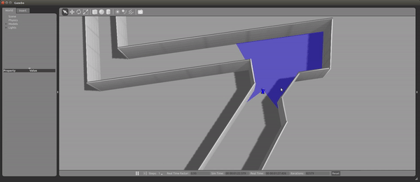
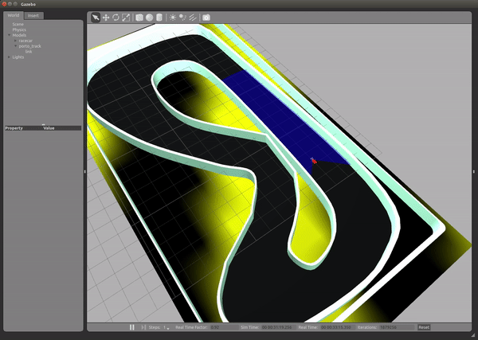

# Introduction:
This repository contains information to run a racecar autonomously in a race-track/circuit. Line-tracking algorithm dictates the trajectory that the car follows by maintaining a certain distance from the left and the right wall as seen by the sensor data. For Control, PID algorithm is implimented. Simulator is made using ROS/Gazebo. The simulation has been tested on and works well in Ubuntu 14.04 with ROS Indigo installed and Gazebo version 2.2.6.

How is the Car Running?
---

1. Starting from a default location in the map, the laser scan data is outputted by the gazebo server.This scan data is fed into our wall-following node by subscibing to this laser scan output. The wall-following algorithm checks for obstacles and makes a decision to follow either left or the right wall depending on what desired trajectory is required. The Python script where this algorithm is written is named levineDemo.py
2. From the wall-following node, the difference between desired trajectory and current position is outputted (published) as an error, which is subscibed to by the PD controller. As written in control.py, the corresponding equations calculate required angle and velocity in the following way:

        angle = previousAngle + kp*error + kd*(previousError - newError)
    
        velocity = previousVelocity + kp*error + kd*(previousError - newError)
    
3. The velocities and angles, starting from initial values of  1 m/s and 18 degrees, are both capped to output reasonable values and angles are converted into radians. Kp and Kd are set to be 10, 0.1 and 42, 0 respectivelly for angle and velocity corrections, in that order.
4. Next, the angles and velocities (in radians) are outputted as drive parameters and are fed into sim connector node. This is further connected to gazebo server and the car is moved in the simulation.
5. The scan output updates and is once again read by the wall-follower to output desired parameters and this process keeps the car running in the loop!


# F1-Tenth Simulation Set-up: 



Instructions
---

* Create your workspace folder. If you are comfortable with Linux, create this in whatever location you desire and name it appropriately, but following this tutorial verbatim will minimize your chance of error.
  ```sh
  $ cd ~/Desktop
  $ mkdir -p sims_ws/src
  ```

* Clone the following repositories into a source folder:

  ```sh
  $ cd sims_ws/src
  $ git clone https://github.com/wjwwood/serial.git
  $ git clone https://github.com/mit-racecar/racecar.git
  $ git clone https://github.com/mlab-upenn/racecar-simulator.git
  $ git clone https://github.com/mit-racecar/vesc.git
  $ git clone https://github.com/ros-drivers/ackermann_msgs.git
  $ git clone https://github.com/mlab-upenn/f1_10_sim.git
  ```
  
* Turn Python scripts into executables.
  ```sh
  $ cd f1_10_sim/race/scripts
  $ chmod +x *.py
  $ cd ../../..
  ```
  
* Instantiate your workspace. (You should be in 'src' folder now)
  ```sh
  $ catkin_init_workspace
  ```
  
* Move back to your workspace folder and create necessary folders.
  ```sh
  $ cd ..
  $ catkin_make install
  ```
  
* Source the setup.bash file from inside devel.
  ```sh
  $ echo "source ~/Desktop/sims_ws/devel/setup.bash" >> ~/.bashrc
  $ source ~/.bashrc
  ```

* Congratulations! Your F1Tenth simulator is now all set up. The following instructions are to boot up the simulator. Note: Run both thes commands in different terminal windows/tabs. If an address in use error pops up, type killall gzserver and try again.
  ```sh
  $ roscore
  $ roslaunch race f1_tenth.launch
  ```
  
 
 
 
Special Note
---
This simulator was build by teams at MIT to drive a car using keyboard buttons and was modified to drive the car autonomously.
